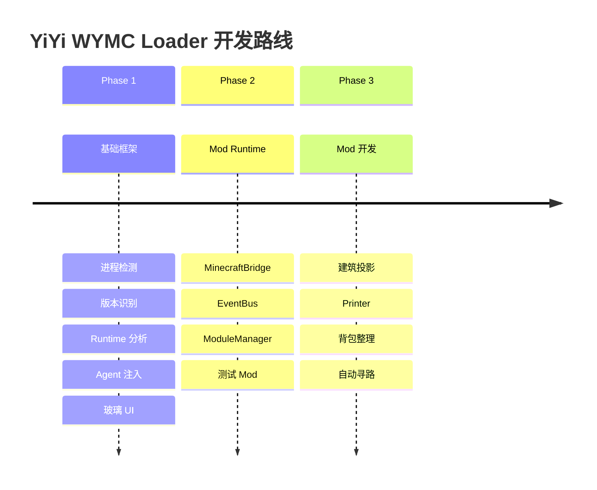

<div align="center">


# YiYi WYMC Loader

<p align="center">
  
  
  
  
</p>

<p align="center">
  <strong>网易 Minecraft 运行时分析与 Mod 加载工具</strong>
</p>

<p align="center">
  <a href="#-功能特性">功能特性</a> •
  <a href="#-快速开始">快速开始</a> •
  <a href="#-使用指南">使用指南</a> •
  <a href="#-开发文档">开发文档</a> •
  <a href="https://github.com/fxjcangku/yiyiaddon-wymc/releases">下载</a>
</p>

---


<p align="center">
  <em>一键检测 → 分析 Runtime → 注入 Agent → 导出报告</em>
</p>

</div>

---

## 💡 项目简介

YiYi WYMC Loader 是专为**网易 Minecraft Java 版**设计的运行时分析与 Mod 加载工具。

<table>
<tr>
<td width="50%">

### 🎯 核心功能

- 🔍 **运行时分析** - 自动识别版本、分析混淆、探测 Runtime 结构
- 💉 **动态注入** - 基于 Java Agent 的标准注入方案
- 🎯 **智能检测** - 自动识别网易 MC 进程，不误检其他启动器
- 🎨 **现代 UI** - iOS 风格玻璃质感界面

</td>
<td width="50%">

### ⚡ 技术亮点

- ✅ 标准 Java API，无需修改游戏文件
- ✅ 智能进程检测，排除 PCL/HMCL 等
- ✅ 完整 Runtime 分析报告
- ✅ 玻璃质感现代化界面

</td>
</tr>
</table>

---

## 🎬 演示视频

<div align="center">

| 界面展示 | 功能演示 | 报告输出 |
|:-------:|:-------:|:-------:|
|  |  |  |
| 玻璃质感界面 | Runtime 分析 | 完整报告 |

</div>

---

## ✨ 功能特性

<details open>
<summary><b>🔍 智能进程检测</b></summary>

```
✓ 自动扫描所有 Java 进程
✓ 智能识别网易 Minecraft
✓ 排除 PCL/HMCL/开发环境
✓ 自动提取版本、路径、Java 信息
✓ 多维度评分算法
```

**检测算法**：
- 必须包含 `netease` 标识
- 排除其他启动器（PCL/HMCL/BakaXL/MultiMC）
- 排除开发环境（yiyiaddon/fabric/forge/dev）
- 智能评分选择最佳进程

</details>

<details>
<summary><b>⚙️ Runtime 深度分析</b></summary>

```
✓ 封装类型识别 (Vanilla/Fabric/Forge/NetEase)
✓ 混淆检测 (Yarn/MCP/Mojang/Custom)
✓ ClassLoader 结构分析
✓ Runtime 转换探测 (ASM/Mixin/...)
✓ 类加载路径追踪
```

**分析维度**：
- **封装层** - 识别游戏启动器类型
- **混淆层** - 检测类名混淆方式
- **加载层** - 分析 ClassLoader 结构
- **转换层** - 探测字节码转换工具

</details>

<details>
<summary><b>💉 Java Agent 注入</b></summary>

```
✓ 标准 Attach API
✓ Instrumentation 能力检测
✓ ClassLoader 完整分析
✓ Minecraft 类探测
✓ 实时日志输出
✓ 非侵入式设计
```

**技术方案**：
- 使用 JDK 自带的 `VirtualMachine.attach()`
- 通过 `Instrumentation` 获取 Runtime 信息
- 只读分析，不修改游戏逻辑（Phase 1）

</details>

<details>
<summary><b>📊 完整报告生成</b></summary>

生成三类 JSON 报告：

1. **EnvironmentReport.json** - 环境信息
   - PID、Java 版本、MC 版本
   - 游戏目录、工作目录
   - 服务器连接信息

2. **RuntimeUnpackReport.json** - 脱壳分析
   - 封装类型、混淆类型
   - ClassLoader 信息
   - Runtime 转换探测
   - Mapping 建立状态

3. **RuntimeDifferenceReport.json** - 差异对比
   - 标准 Minecraft 对比
   - Fabric Runtime 对比
   - 网易 Runtime 特征

</details>

---

## 🎨 界面展示

<div align="center">

### 玻璃质感设计

<table>
<tr>
<td align="center">
<br>
<em>主界面 - 信息展示</em>
</td>
<td align="center">
<br>
<em>检测中状态</em>
</td>
</tr>
<tr>
<td align="center">
<br>
<em>检测成功</em>
</td>
<td align="center">
<br>
<em>Agent 已加载</em>
</td>
</tr>
</table>

### 设计特色

<table>
<tr>
<td width="25%" align="center">
<br>
<b>玻璃质感</b><br>
<sub>半透明面板</sub>
</td>
<td width="25%" align="center">
<br>
<b>现代按钮</b><br>
<sub>渐变悬停</sub>
</td>
<td width="25%" align="center">
<br>
<b>状态反馈</b><br>
<sub>色彩指示</sub>
</td>
<td width="25%" align="center">
<br>
<b>iOS 风格</b><br>
<sub>整体配色</sub>
</td>
</tr>
</table>

</div>

---

## 🚀 快速开始

### 📋 系统要求

<table>
<tr>
<td><b>操作系统</b></td>
<td>Windows 10/11</td>
</tr>
<tr>
<td><b>Java 版本</b></td>
<td>JDK 17 或更高</td>
</tr>
<tr>
<td><b>网易 MC</b></td>
<td>已安装并可正常运行</td>
</tr>
<tr>
<td><b>内存</b></td>
<td>建议 4GB+</td>
</tr>
</table>

### 📥 下载安装

<div align="center">

**[📦 下载最新版本](https://github.com/fxjcangku/yiyiaddon-wymc/releases/latest)**

| 文件 | 大小 | 说明 |
|------|------|------|
| `YiYi-WYMC-Loader.jar` | 4.3 MB | 主程序 |
| `wymc-agent.jar` | 10 KB | Agent |

</div>

### ⚡ 快速运行

```bash
# 下载后直接运行
java -jar YiYi-WYMC-Loader.jar
```

或双击 JAR 文件（需要配置 Java 环境变量）。

---

## 📚 使用指南

<div align="center">

### 🎯 四步完成分析


</div>

### 详细步骤

<details>
<summary><b>步骤 1：启动网易 Minecraft</b></summary>

1. 打开网易 MC 启动器
2. 登录账号
3. 启动游戏
4. 进入主菜单或单人世界

**注意**：
- 必须使用网易官方启动器
- 不支持 PCL/HMCL 等第三方启动器
- 等待游戏完全加载

</details>

<details>
<summary><b>步骤 2：运行 WYMC Loader</b></summary>

```bash
java -jar YiYi-WYMC-Loader.jar
```

**自动检测**：
- Loader 启动后自动扫描进程
- 识别网易 MC 进程
- 显示 PID、版本、Java 信息

**手动检测**：
- 点击「重新检测」按钮
- 适用于游戏后启动 Loader 的情况

</details>

<details>
<summary><b>步骤 3：分析 Runtime</b></summary>

点击 **「分析 Runtime」** 按钮：

**分析内容**：
- ✅ 封装类型（VANILLA/FABRIC/NETEASE_CUSTOM）
- ✅ 混淆类型（NONE/YARN/CUSTOM_OBFUSCATED）
- ✅ ClassLoader 类型（STANDARD/CUSTOM）
- ✅ Runtime 转换工具

**显示位置**：
- Runtime 区域显示分析结果
- 彩色状态指示

</details>

<details>
<summary><b>步骤 4：加载 Agent</b></summary>

点击 **「加载 Agent」** 按钮（绿色）：

**控制台输出**：
```
[WYMC] Agent attached successfully
[WYMC] Instrumentation initialized
[WYMC] Found 5 ClassLoaders
[WYMC] Minecraft classes: 3254
[WYMC] NetEase classes: 127
[WYMC] Sample classes:
  - net.minecraft.client.Minecraft
  - net.minecraft.client.player.LocalPlayer
  ...
```

**GUI 显示**：
- Attach: SUCCESS ✅
- Agent: LOADED ✅
- Instrumentation: AVAILABLE ✅

</details>

<details>
<summary><b>步骤 5：导出报告</b></summary>

点击 **「导出报告」** 按钮：

**生成文件**：
```
~/.yiyiaddon-wymc/
├── reports/
│   ├── EnvironmentReport.json
│   ├── RuntimeUnpackReport.json
│   └── RuntimeDifferenceReport.json
└── logs/
    └── wymc-loader.log
```

**打开报告**：
- 点击「打开日志」按钮
- 或手动打开上述目录

</details>

---

## 🛠️ 开发文档

<details>
<summary><b>📁 项目结构</b></summary>

```
yiyiaddon-wymc/
├── wymc-launcher/          # 启动器（独立进程）
│   ├── ui/
│   │   ├── MainWindow.java
│   │   └── components/     # 玻璃质感组件
│   ├── process/            # 进程检测
│   ├── environment/        # 环境分析
│   ├── analysis/           # Runtime 分析
│   ├── attach/             # Agent 附加
│   └── report/             # 报告生成
├── wymc-agent/             # Agent（注入到 MC）
│   └── analysis/           # 深度分析
├── 开发报告/               # 技术文档
│   ├── 01-阶段报告/
│   ├── 02-技术文档/
│   └── 03-构建日志/
└── docs/                   # 用户文档
```

</details>

<details>
<summary><b>🏗️ 技术栈</b></summary>

| 技术 | 用途 | 版本 |
|------|------|------|
| Java | 开发语言 | 17+ |
| Swing | GUI 框架 | JDK 自带 |
| Java Attach API | Agent 注入 | JDK 自带 |
| Instrumentation | 字节码操作 | JDK 自带 |
| JNA | Windows API | 5.13.0 |
| Gson | JSON 处理 | 2.10.1 |
| SLF4J + Logback | 日志系统 | 2.0.9 / 1.4.11 |

</details>

<details>
<summary><b>🔧 编译构建</b></summary>

```bash
# 克隆仓库
git clone https://github.com/fxjcangku/yiyiaddon-wymc.git
cd yiyiaddon-wymc

# 下载依赖（Windows PowerShell）
# 见 网易MC安装和测试指南.md

# 编译
javac --release 17 -encoding UTF-8 -cp "build/libs/deps/*" ...

# 打包
jar cfe YiYi-WYMC-Loader.jar com.yiyiaddon.wymc.launcher.WymcLauncher ...
```

详细步骤见 [网易MC安装和测试指南.md](网易MC安装和测试指南.md)

</details>

<details>
<summary><b>📖 文档导航</b></summary>

- [技术架构文档](开发报告/02-技术文档/技术架构文档.md)
- [UI 实现指南](开发报告/02-技术文档/玻璃质感UI实现指南.md)
- [Phase 1 完成报告](开发报告/01-阶段报告/20260924-Phase1-完成报告.md)
- [开发进展报告](开发报告/01-阶段报告/开发进展报告-20260924.md)
- [贡献指南](CONTRIBUTING.md)

</details>

---

## ❓ 常见问题

<details>
<summary><b>Q: 为什么找不到 Minecraft 进程？</b></summary>

**可能原因**：
1. 网易 MC 未启动或未完全加载
2. 使用了其他启动器（PCL/HMCL）
3. 使用了开发环境（yiyiaddon 项目）

**解决方法**：
- 确认使用网易官方启动器
- 等待游戏完全加载后点击「重新检测」
- 查看日志：`~/.yiyiaddon-wymc/logs/wymc-loader.log`

</details>

<details>
<summary><b>Q: Agent 加载失败怎么办？</b></summary>

**可能原因**：
1. Java 版本不兼容（需要 JDK 17+）
2. 权限不足
3. Agent JAR 文件损坏或路径错误

**解决方法**：
- 检查 Java 版本：`java -version`
- 以管理员权限运行 Loader
- 重新下载 Agent JAR
- 查看详细错误日志

</details>

<details>
<summary><b>Q: 支持 Fabric/Forge 吗？</b></summary>

**当前状态**：
- ✅ **检测支持** - 可以识别 Fabric/Forge 环境
- ✅ **分析支持** - 可以分析 Runtime 结构
- ⏳ **Mod 加载** - Phase 2 将支持

**兼容性**：
- 设计目标：网易原版 Minecraft
- Fabric/Forge：需要额外适配（计划中）

</details>

<details>
<summary><b>Q: 会被检测/封号吗？</b></summary>

**安全说明**：
- ✅ 使用标准 Java API
- ✅ Phase 1 仅进行**只读分析**
- ✅ 不修改游戏逻辑
- ✅ 不干扰正常游戏

**风险提示**：
- ⚠️ 未来 Phase 2/3 将实现 Mod 功能
- ⚠️ 任何客户端修改都存在理论风险
- ⚠️ **请自行承担使用风险**

</details>

<details>
<summary><b>Q: 为什么只支持 Windows？</b></summary>

**技术原因**：
- 进程检测使用了 Windows API（JNA）
- 网易 MC 主要运行在 Windows

**未来计划**：
- 可能支持 Linux/macOS（需要适配）
- 欢迎贡献跨平台代码

</details>

---

## 🗺️ 开发路线

<div align="center">



</div>

### ✅ Phase 1 - 基础框架（已完成）
- [x] Minecraft 进程检测
- [x] 版本自动识别
- [x] Runtime 分析器
- [x] Java Agent 注入
- [x] 玻璃质感 UI
- [x] 完整报告系统

### 🚧 Phase 2 - Mod Runtime（开发中）
- [ ] MinecraftBridge（游戏 API 桥接）
- [ ] EventBus（事件系统）
- [ ] ModuleManager（模块管理）
- [ ] 测试 Mod（HUD 显示）

### 📅 Phase 3 - Mod 开发（计划中）
- [ ] 建筑投影 Mod
- [ ] Printer / 建筑辅助
- [ ] 背包整理
- [ ] 自动寻路（Baritone 集成）
- [ ] Fabric Mod 兼容

---

## 🤝 贡献

欢迎贡献代码、报告 Bug 或提出建议！

<div align="center">

| 贡献方式 | 链接 |
|---------|------|
| 🐛 报告 Bug | [提交 Issue](https://github.com/fxjcangku/yiyiaddon-wymc/issues/new?template=bug_report.md) |
| 💡 功能建议 | [提交 Issue](https://github.com/fxjcangku/yiyiaddon-wymc/issues/new?template=feature_request.md) |
| 📖 改进文档 | [提交 PR](https://github.com/fxjcangku/yiyiaddon-wymc/pulls) |
| 🔧 提交代码 | [贡献指南](CONTRIBUTING.md) |

</div>

### 代码规范
- 遵循 Google Java Style Guide
- 代码注释使用中文
- Commit 信息使用 Conventional Commits

---

## 📜 开源协议

本项目采用 [MIT License](LICENSE) 开源协议。

```
MIT License - Copyright (c) 2024 YiYi Addon Team
```

---

## 🙏 致谢

<table>
<tr>
<td align="center">
<br>
<b>Minecraft</b><br>
<sub>Mojang Studios</sub>
</td>
<td align="center">
<br>
<b>网易 MC</b><br>
<sub>NetEase Games</sub>
</td>
<td align="center">
<br>
<b>Fabric</b><br>
<sub>参考设计</sub>
</td>
<td align="center">
<br>
<b>社区</b><br>
<sub>贡献者</sub>
</td>
</tr>
</table>

特别感谢所有提供反馈和建议的用户！

---

## 📞 联系方式

<div align="center">

[](https://github.com/fxjcangku/yiyiaddon-wymc/issues)
[](https://github.com/fxjcangku/yiyiaddon-wymc/discussions)
[](https://github.com/fxjcangku/yiyiaddon-wymc/stargazers)

**如果这个项目对你有帮助，请给个 ⭐ Star！**

</div>

---

<div align="center">

<sub>Made with ❤️ by YiYi Addon Team</sub>

</div>
